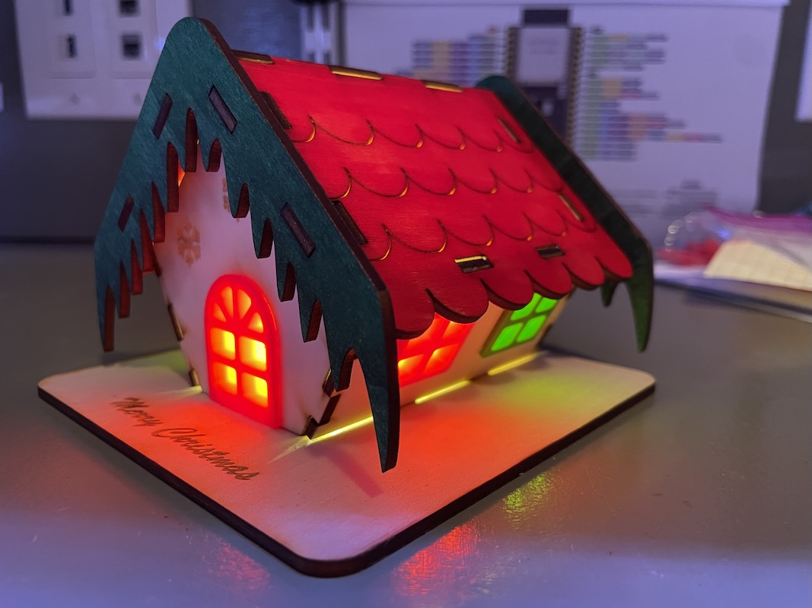
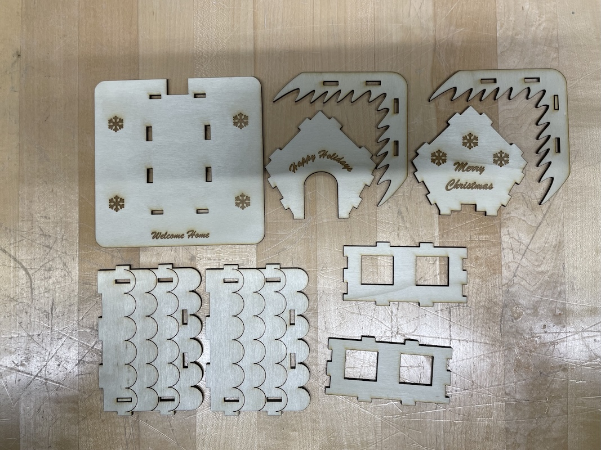
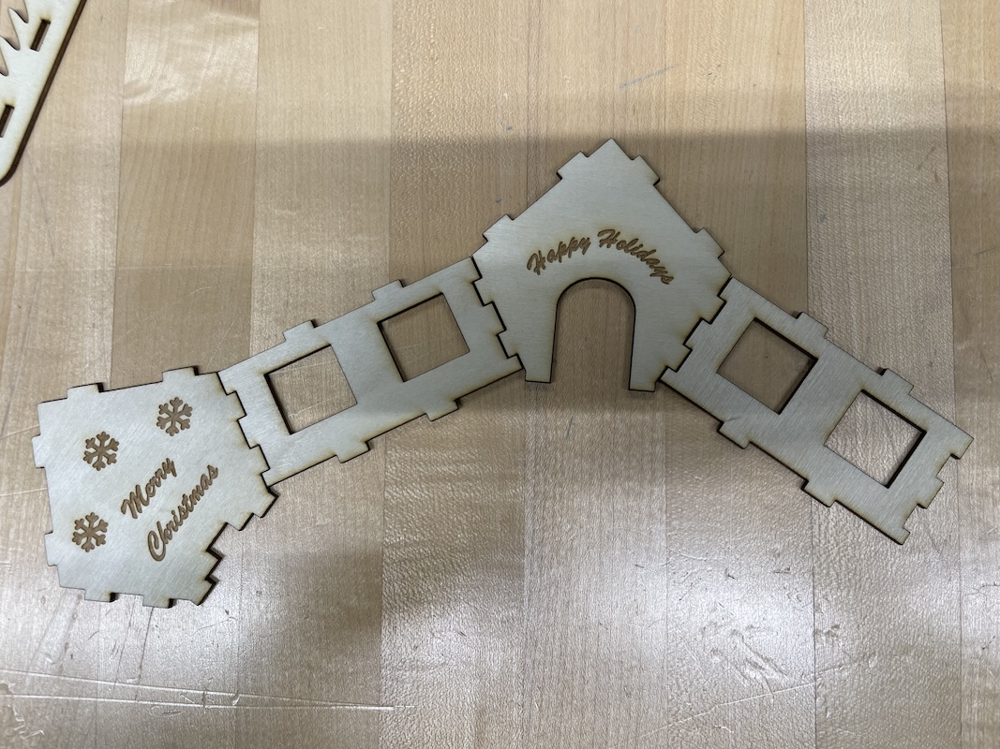
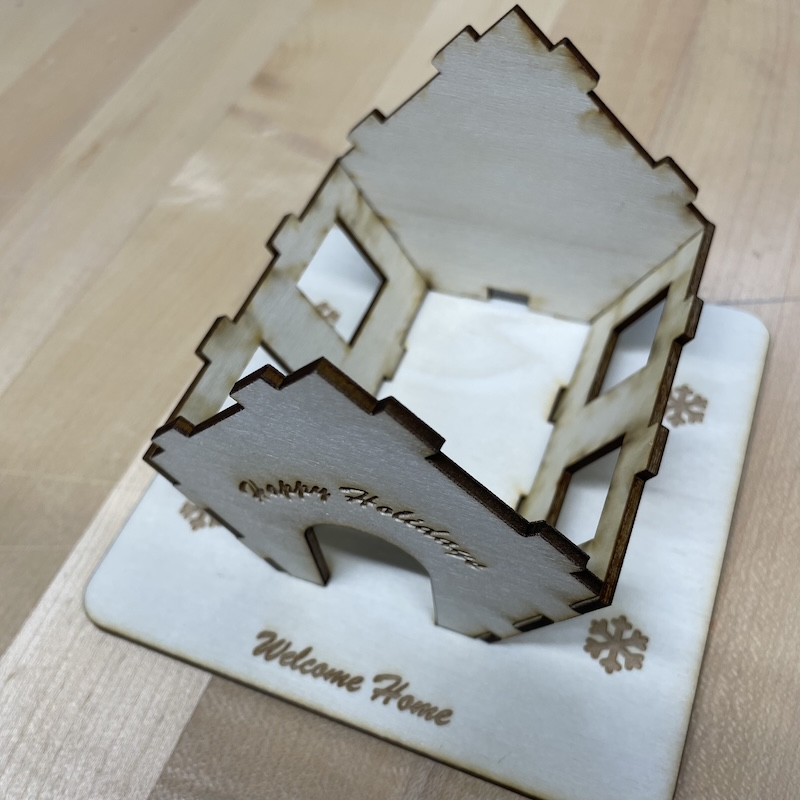
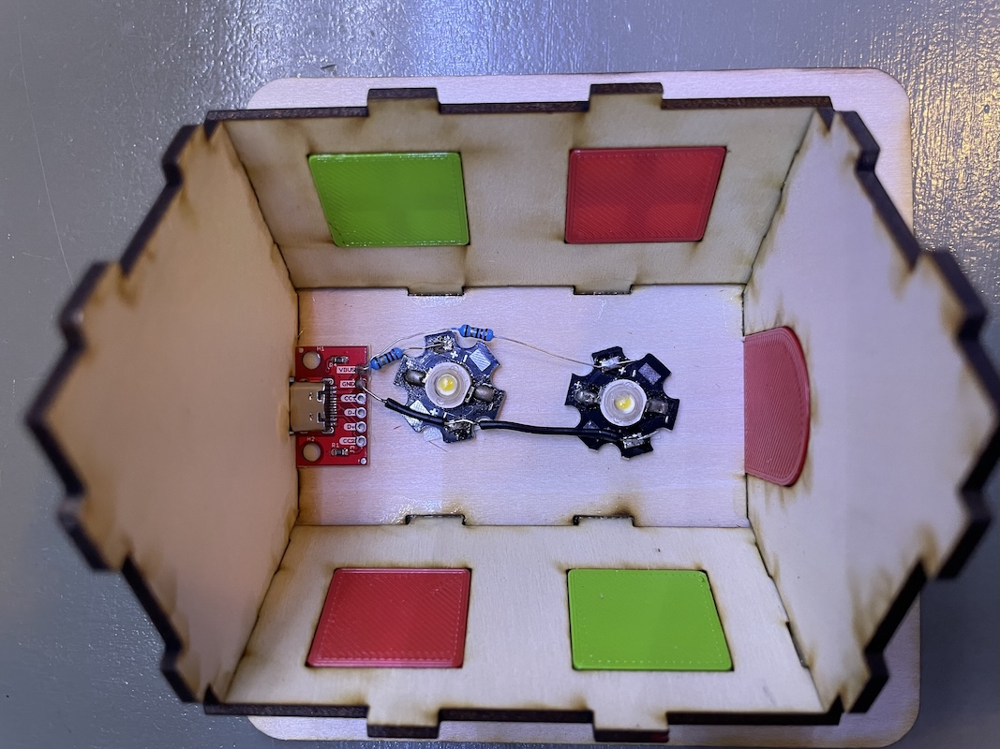
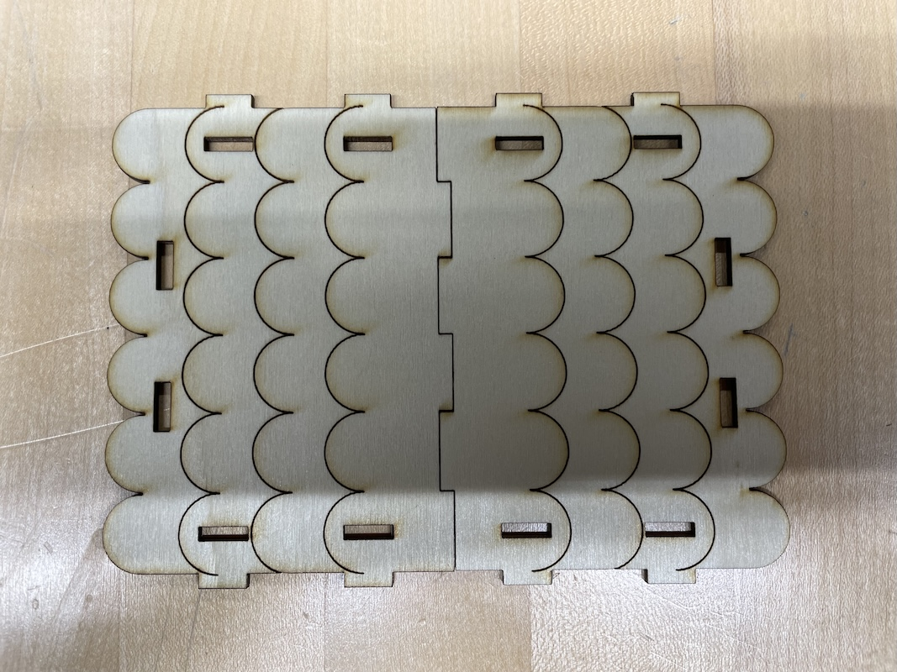
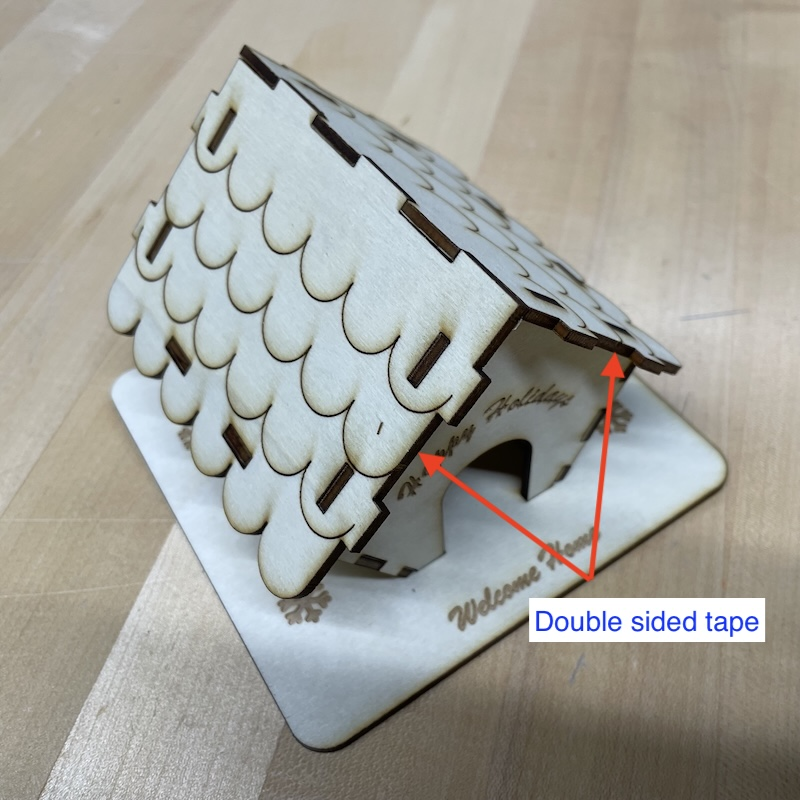

# Gingerbread House

## Materials and tools

### Equipment
* 3d printer
* Laser cutter

### Materials and tools
* Red and green filament (door and windows)
* 1/8" basswoord boards [Amazon](https://www.amazon.com/dp/B0D91F14Y2)
* COB LED light [AliExpress](https://www.aliexpress.us/item/3256807134620275.html) | [Amazon](https://www.amazon.com/dp/B07DHB13J4)
* USB-C breakout board [AliExpress](https://www.aliexpress.us/item/3256809276708466.html) | [Amazon](https://www.amazon.com/dp/B0F2S1K5X8)
* 22 Ohm resistor x 2
* USB-C cable

* PVA glue (aka school glue or book binding glue). Alternatives: hot glue, super glue, wood glue, B7000, etc. Anything that works for paper will work for wood (what is paper but wood?). It does not need to be very strong.
* Double sided tape.

If you want to give your gingerbread house some colors:

* Red, green, nutmeg spray paints. Alternatives: permanent markers, dry erase markers, craft pens, etc. Anything that can color unfinished wood will work.

## Laser cutting

You can download the [SVG file](./template.svg) and directly feed it to your laser cutting software. all pieces are arranged to be cut from a 300x300mm sheet. If your app splits it into two or more jobs, generally you want to engrave before cutting, although it doesn't matter much here.

I am using three colors in the SVGs and mapping them into cutting, marking, and engraving. The cutter I am using is a *40 Watt Epilog Mini* with a 600x300 mm bed. The following is the settings I am using in VisiCut. You may experiment with these values based your material and laser cutter. The cut setting may also slightly change the dimension of the piece. The deeper the cut, the more material is burned. If the fit is too loose, you may consider lower the power or increase the speed in the cut setting.

| Color | Action | Power | Speed |
| ----- | ------ | ----- | ----- |
| ${\color{red}\textsf{Red}}$ | Cut | 100 | 35 |
| ${\color{blue}\textsf{Blue}}$ | Mark | 30 | 50 |
| ${\color{green}\textsf{Green}}$ | Engrave | 100 | 50 |

If you're handy witn an SVG editor, get creative and modify the engravings to your likings.

## 3D printing

The STLs for the door and windows can be found in this directory. I am using a *Flashforge Adventure 3 Lite* printer. I am printing two red windows and two green ones. The models were created with Autodesk Fusion (free for personal use). In the slicer (FlashPrint 5), I sliced the models with no raft and linear supports. The flanges of the door and window are overhanging. Although just a little bit, they don't work well without supports. 

You may need to adjust your slicer settings depending on your printer, filament, and slicer. If you need to make adjustments to the models themselves, you can download the Fusion file in this folder and edit it in Autocad Fusion.

## Lights

I am using two LEDs in paralell. They are rated 3V 1W. With a 22 Ohm resistor in series, I am getting just about 3V on the LED. But I am only measuring 90 mA. That's only 0.27W. But two are bright enough for this project.

The whole circuitry is soldered onto the USB-C breakout board. The board has two 5.1k resistors for triggering USB PD at 5V. So this works with "smart" chargers too. If you don't need to worry about smart chargers, there are cheaper breakout boards available.

## Assembly

All parts snap fit together. However, since plywood is not nearly as plastic as, well, plastic, I cut the wooden pieces with slightly more gap than I would plastic. As a result, the wooden pieces fit snuggly, but not too tight, otherwise the risk of breaking or splitting is high. So I rely on a smudge of PVA glue to hold the body of the house to the base. Even so, be very gentel when trying to snap piece together. Don't try to force anything.

I recommend putting all piece together at least once, without applying glue for real, before painting them (literally a *dry* run without glue or paint). If you break a piece, at least you didn't waste time painting it. Also, once the pieces have been fitted and disassembled once, it's usually easier the second time.

Step 1: snap the 4 walls together, then carefully insert them into the base. Avoid using too much force. If the fitting is too tight, use a file or sandpaper to file off a little woord.  Once it's snug and secure, apply a little glue to bottom seams. Leave it to cure. The duration depends on your glue. If you are impatient, use super glue or hot glue. But I prefer slow curing glue so that I can make small adjustments while it's curing. I also prefer glue with a little flexibility, such as PVA glue.

Step 2: use double sided tapes to fasten the circuitry to the base, aligning the USB port to the opening in the back. The lights just need a little bit of tape since they don't bear any force. The USB-C breakout board needs to sustain the force of plugging and unplugging the cable, so it needs to be securely fastened. Use a few drops of hot glue or super glue if desired.

Step 3: carefully snap both pieces of the roof to the walls. It requires a little dexterity and patience. Stick your finger into the door and window to hold or jiggle the walls if needed. I reccommend starting from the two tabs connecting the roof to the wall, and working your way up to the top of the A-frame. My experience is that you don't need glue for the roof. The number of tabs and their opposing angles are enough to keep it pretty secure. I also prefer not using glue so that I can open it up if needed.

Step 4: firmly press the 3d printed door and windows into the walls. Ideally, they won't need any glue to be secured. Otherwise, you would have to undo the last step and apply glue from inside. But once the windows are installed, it's hard to install the roofs.

Step 5: cut a few very thin (~2.5mm) strips of double sided tape, put them on the sides of the roofs, then insert the eaves and press them firmly onto the tape. This ensures that they don't fall off on their own. But if needed, you can still easily remove them and open up the roof. You may also not need the tape if they fit very securely.